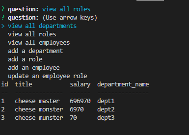

# employee-tracker

  - [employee-tracker](#employee-tracker)
  - [Description](#description)
  - [Installation](#installation)
  - [Usage](#usage)
  - [Tests](#tests)
  - [Contribution guidelines](#contribution-guidelines)
  - [Questions](#questions)
  - [License](#license)

## Description

a command line app to keep track of employees and their salaries and roles

---

## Installation

requires several npm packages. be sure to run npm install mysql2, npm install inquirer, and npm install cTable before using. Use node to  be able to run the application. Also requires the database to be initialized by running SOURCE /db/schema.sql from the command line in mysql.

---

## Usage

used to keep track of departments of people and their salaries as well as who people report to and what department they belong to.

---

## Contribution guidelines

If you'd like to contribute, make an issue if theres something I missed and I'll get to it when I can. Or clone the repo and go nuts. I won't stop you.

---

## Questions

If you have any questions, reach me on [github](https://github.com/JaHa675)

or email me here at James.Harding675@gmail.com

---

## License

MIT

---

